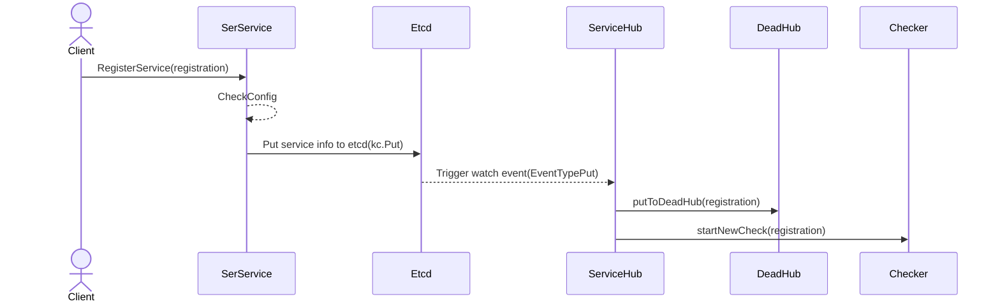
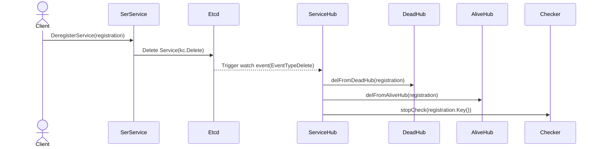
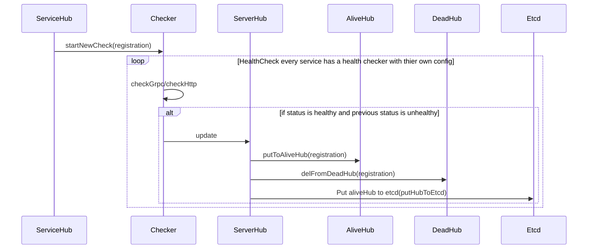
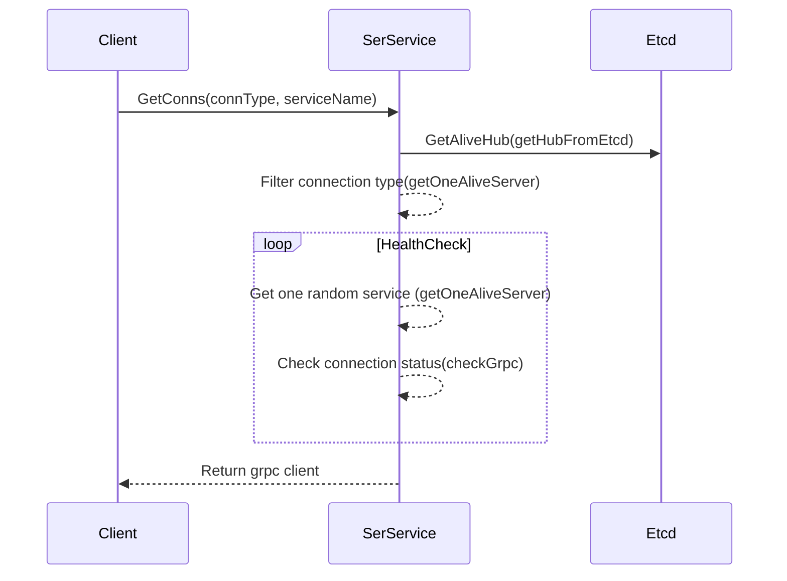

# Etcd UI

[](https://pkg.go.dev/github.com/cruvie/kk_etcd_go)

A modern and easy to use Client/UI for `Etcd`

A Configuration center and Service registration and discovery platform based on `Etcd`

## Feature

- [x] Configuration center

- [x] Service registration and discovery for Http/gRPC Server

- [x] MCP Server

- [x] User management

- [x] Role management

- [ ] AI

## service


## key value


## AI


# How to use?🤔

download [example](https://github.com/cruvie/kk_etcd_go/tree/master/example)

```shell
cd example
docker-compose up -d
```

you can change `version` to a specific version
on [docker hub](https://hub.docker.com/r/cruvie/kk_etcd_ui/tags)

# Warning ❗

Make sure the client and server use the same version, they will be updated together,
incompatible versions may make some unexpected errors.

# Client

[Homepage Client](https://github.com/cruvie/kk_etcd_ui)

[Download](https://github.com/cruvie/kk_etcd_ui/releases)

| Windows/MacOS/Linux | Web               | Docker |
|---------------------|-------------------|--------| 
| ✅                   | ✅                 | ✅      |
| build from source   | build from source | ✅      |

then visit http://localhost:2334

## Server

[Homepage Server](https://github.com/cruvie/kk_etcd_go)

# SDK

```shell
  go get github.com/cruvie/kk_etcd_go@latest
```

## Put/Get config into/from etcd in yaml/json format

refers
to [Put/Get](https://github.com/cruvie/kk_etcd_go/blob/566e340dee0ca3b38bff574fe223887035fe67d6/kk_etcd/kv_test.go)

## Register Http/gRPC Service to etcd

refers
to [Register Http Service](https://github.com/cruvie/kk_etcd_go/blob/566e340dee0ca3b38bff574fe223887035fe67d6/kk_etcd/service_test.go)

## Get a grpc client from etcd

refers
to [GetGrpcClient](https://github.com/cruvie/kk_etcd_go/blob/566e340dee0ca3b38bff574fe223887035fe67d6/kk_etcd/service_grpc.go)

# Service Hub Design

## Register a service



## Deregister a service



## Health check



## Get a grpc connection



# Contribute

Feel free to send pull requests or fire issues
if you encounter any bugs or have suggestions.

# Donate

Buy me a cup of coffee ☕️ if you like this project and want to keep it active.

| Alipay                                                                                         | Wechat                                                                                         |
|------------------------------------------------------------------------------------------------|------------------------------------------------------------------------------------------------|
|  |  | 

# Thanks

This project is supported by [JetBrains](https://jb.gg/OpenSourceSupport).

