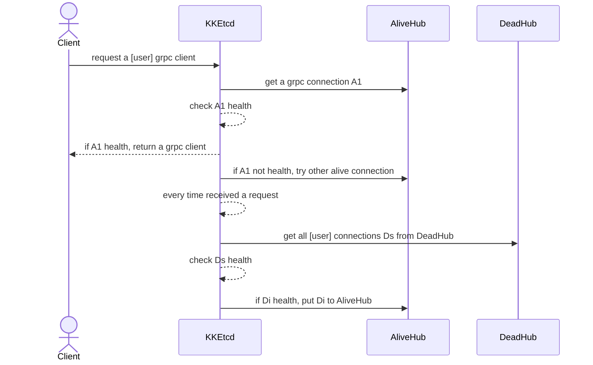

https://etcd.io/docs/v3.5/op-guide/authentication/rbac/
must create root user and root role first, for etcd's special requirement, root user can operate any content

```mermaid
sequenceDiagram
    actor Client
    Client ->> KKEtcd: request a [user] grpc client
    KKEtcd ->> AliveHub: get a grpc connection A1
    KKEtcd -->> KKEtcd: check A1 health
    KKEtcd -->> Client: if A1 health, return a grpc client
    KKEtcd ->> AliveHub: if A1 not health, try other alive connection
    KKEtcd -->> KKEtcd: every time received a request
    KKEtcd ->> DeadHub: get all [user] connections Ds from DeadHub
    KKEtcd -->> KKEtcd: check Ds health
    KKEtcd ->> AliveHub: if Di health, put Di to AliveHub
```